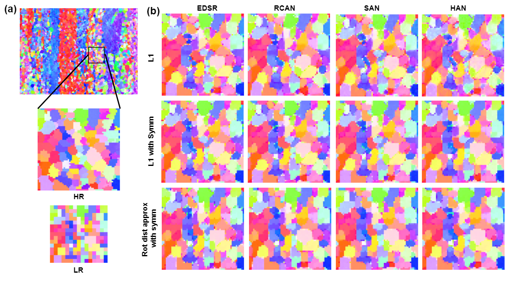

# EBSD-Superresolution: Adaptable Physics-Based Super-Resolution for Electron Backscatter Diffraction Maps
[Devendra K. Jangid*](https://sites.google.com/view/dkj910), [Neal R. Brodnik*](https://scholar.google.com/citations?user=3dAoFJkAAAAJ&hl=en), [Michael G. Goebel](https://scholar.google.com/citations?user=FwMJrygAAAAJ&hl=en), [Amil Khan](https://scholar.google.com/citations?user=r6jNH5UAAAAJ&hl=en), [SaiSidharth Majeti](), [McLean P. Echlin](https://scholar.google.com/citations?user=fxN2OsUAAAAJ&hl=en), [Samantha H. Daly](https://scholar.google.com/citations?user=3whYx4UAAAAJ&hl=en), [Tresa M. Pollock](https://materials.ucsb.edu/people/faculty/tresa-pollock), [B.S. Manjunath](https://scholar.google.com/citations?user=wRYM4qgAAAAJ&hl=en)

[* equal contirbution]

[Paper](https://www.nature.com/articles/s41524-022-00924-2) ||
[Poster](https://github.com/UCSB-VRL/EBSD-Superresolution/blob/main/images/EBSD_SR_Poster_24x36_final.pdf)

<hr />

> **Abstract:** *In computer vision, single image super-resolution (SISR) has been extensively explored using convolutional neural networks (CNNs) on optical images, but images outside this domain, such as those from scientific experiments, are not well investigated. Experimental data is often gathered using non-optical methods, which alters the metrics for image quality. One such example is electron backscatter diffraction (EBSD), a materials characterization technique that maps crystal arrangement in solid materials, which provides insight into processing, structure, and property relationships.  We present a broadly adaptable approach for applying state-of-art SISR networks to generate super-resolved EBSD orientation maps.  This approach includes quaternion-based orientation recognition, loss functions that consider rotational effects and crystallographic symmetry, and an inference pipeline to convert network output into established visualization formats for EBSD maps. The ability to generate physically accurate, high-resolution EBSD maps with super-resolution enables high throughput characterization and broadens the capture capabilities for three-dimensional experimental EBSD datasets.*
<hr />

## EBSD Framework


## Installation
Step 1: Clone repo  

      git clone "https://github.com/UCSB-VRL/EBSD-Superresolution.git"
      
Step 2: Create Virtual environment

      virtualenv -p /usr/bin/python3.6 ebsdr_sr_venv(name of virtual environment)

Step 3: Activate Virtual environment

      source ebsd_sr_venv/bin/activate
      
Step 4: Download Dependencies

      pip install -r requirements.txt
      
Step 5: Install gradual warmup scheduler. Go to pytorch-gradual-warmup-lr folder

       python setup.py install
       

## Training 
Run
```
./train.sh
```
<table>
      <tr>
          <th align="center">Loss</th>
          <th align="center">dist_type</th>
           <th align="center">syms_req</th>  
      </tr>
       <tr>
          <td align="center">L1</td>
          <td align="center">L1</td>
          <td align="center">False</td>  
      </tr>
       <tr>
          <td align="center">L1 with symmetry</td>
          <td align="center">L1</td>
          <td align="center">True</td>  
      </tr>
        <tr>
          <td align="center">Rotational distance approximation with symmetry</td>
          <td align="center">rot_dist_approx</td>
          <td align="center">True</td>  
      </tr>
<table>


Define the following parameters to train network
   
* ```--input_dir```: "Directory Path to Datasets"
* ```--hr_data_dir```: "Path to High Resolution EBSD Maps relative to input_dir"
* ```--val_lr_data_dir```: "Path to Low Resolution EBSD Val Datasets"
* ```--val_hr_data_dir```: "Path to High Resolution EBSD Val Datasets"
* ```--model```: "Choose one of network architectures from edsr, rfdn, san, han"
* ```--save```: "Folder name to save weights, loss curves and logs"
   
Important parameters in argparser.py 
   
* ```--syms_req```: "It tells whether you want to use symmetry or not during Loss calculation"
* ```--patch_size```: "Size of Patch During Training"
* ```--act```: "Activation Function in Network"
* ```--save_model_freq```: "How frequently do you want to save models"

## Evaluation
      
We will provide inference model on [BisQue](https://bisque2.ece.ucsb.edu/client_service/) as module. You do not need to use following steps if you are using Bisque infrastructure. 
      
Download trained weights for different networks trained with different losses from [here](https://drive.google.com/drive/folders/1IPygG4-ulduOTLtYoZUlqiXVm6RwJeWC)

Put it in ```./experiment/saved_weights/{name_of_file}/model/{name_of_file}.pt```
 
### For example 
      
If you use edsr with L1 loss:
```
./experiment/saved_weights/edsr_l1_ti64/model/edsr_l1_ti64.pt
```      

```--model```: edsr
      
```--save```: 'edsr_l1_ti64'
      
```--model_to_load```: 'edsr_l1_ti64'
      
```--dist_type```: 'l1'
      
```--test_only```    
Run
```
./test.sh
```
The generated results will be saved at ```experiments/saved_weights/edsr_l1_ti64/results/Test_edsr_l1_ti64``` in npy format. It will also generate images (.png) for each quaternion channel.

## Visualization
The model will generate superresolved EBSD map in ```npy``` format. To convert into IPF maps from npy files, please see [IPF Mapping](https://github.com/UCSB-VRL/EBSD-Superresolution/tree/main/IPF_mapping)
      
      
 
## Results


## Datasets
Material datasets will be available by request at discretion of authors. 

## Acknowledgements
This code is built on [HAN](https://github.com/wwlCape/HAN), [SAN](https://github.com/daitao/SAN), [RCAN](https://github.com/yulunzhang/RCAN), and [EDSR](https://github.com/sanghyun-son/EDSR-PyTorch). We thank the authors for sharing their codes. 

## Citation
If you use EBSD-SR, please consider citing:

      @article{jangid2022adaptable,
      title={Adaptable physics-based super-resolution for electron backscatter diffraction maps},
      author={Jangid, Devendra K and Brodnik, Neal R and Goebel, Michael G and Khan, Amil and Majeti, SaiSidharth and Echlin, McLean P and Daly, Samantha H and Pollock, Tresa M and Manjunath, BS},
      journal={npj Computational Materials},
      volume={8},
      number={1},
      pages={255},
      year={2022},
      publisher={Nature Publishing Group UK London}
      }

## Contact
Should you have any question, please contact dkjangid@ucsb.edu or nbrodnik@ucsb.edu
       
